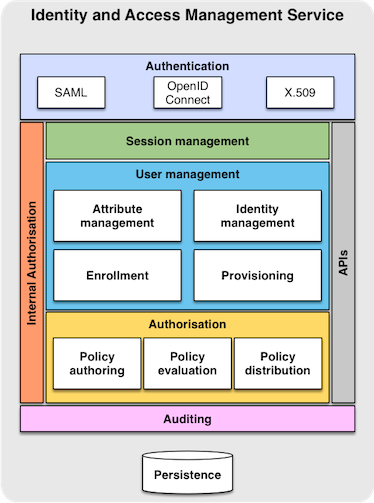

# About Indigo IAM

## Description of the IAM Service

The Identity and Access Management Service provides a layer where identities, enrollment, group membership and other attributes and authorization policies on distributed resources can be managed in an homogeneous way, supporting the federated authentication mechanisms supported by the INDIGO AAI. The IAM service provides user identity and policy information to services so that consistent authorization decisions can be enforced across distributed services.

### Functions

* **Authentication**: The IAM supports the authentication mechanisms defined by the INDIGO AAI architecture (SAML, X.509, OpenID connect)
* **Session management**: the IAM provides session management functionality. Sessions are used to provide single sign-on and logout functionality to client applications and services.
* **Enrollment**: The IAM provides enrollment and registration functionalities, so that users can join groups/collaborations according to user-defined flows.
* **Attribute and identity management**: The IAM provides services to manage group membership, attributes assignment, to group/collaboration administrators and the ability, for users, to consolidate multiple identities in a single INDIGO identity.
* **User provisioning**: the IAM provides endpoints to provision information about users identities to other services, so that consistent local account provisioning, for example, can be implemented
* **Policy definition, distribution and evaluation**: the IAM provides tools and APIs to
    - define authorization policies on distributed resources
    - define policy distribution flows so that policies can be imported from other IAM instances
    - evaluate policies against a request context and issue an authorization decision

### Architecture

The IAM service is composed of basic components (which could be deployed as microservices) providing part of the full IAM functionality.

* The **Authentication** component will deal with user authentication through the supported mechanism (e.g., SAML, X.509, OpenID Connect) and expose the authentication information to the other IAM components.
* The **Internal Authorization** component, which is orthogonal to all exposed services, defines an authorization layer that defines local, IAM-specific authorization policies, like for instance which user is allowed to create a new collaboration, or to cancel sessions in case of a security incident, etc.
* The **Session management** component deals with the management of sessions (search, creation, revocation, etc.), in order to provide support for single sign-on and logout
to client services and applications.
* The **User management** component implements user management functions, like attribute management, identity management, enrollment and registration flows (e.g., how new users can join an existing collaboration), and provisioning.
* The **Authorization** component provides a flexible XACML authorization engine, and exposes policy authoring, evaluation and distribution functionality.
* The **Auditing** component maintains a persistent audit log of all the actions performed in the system.

### Involved Software & Specifications

#### Specifications

* [OpenID connect](http://openid.net/connect/)
* [OAuth 2.0](http://tools.ietf.org/html/rfc6749)
* [SCIM](http://www.simplecloud.info/)
* [SAML](https://www.oasis-open.org/committees/security/)
* [XACML](https://www.oasis-open.org/committees/tc_home.php?wg_abbrev=xacml)

#### Software

* [Mitreid-connect](https://github.com/mitreid-connect/)
* [Argus authorization service](http://argus-authz.github.io/)
