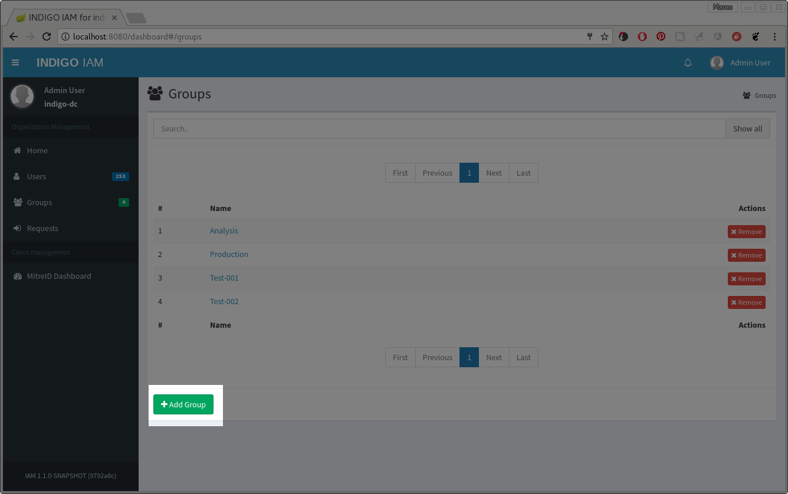
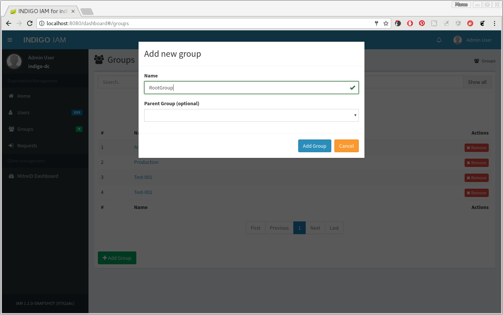
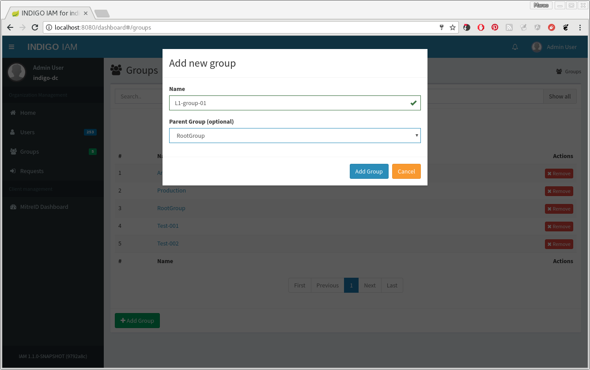
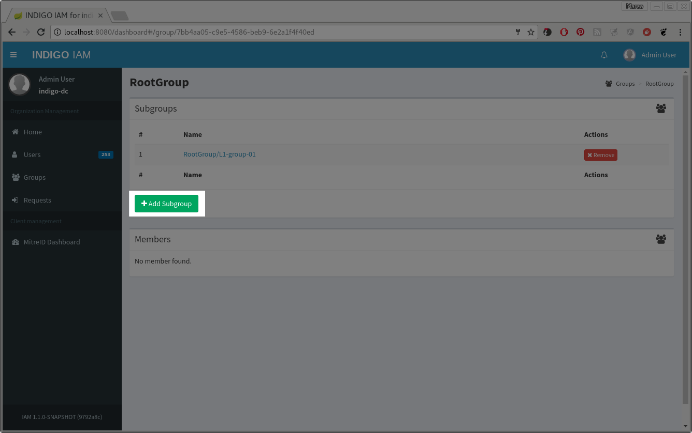
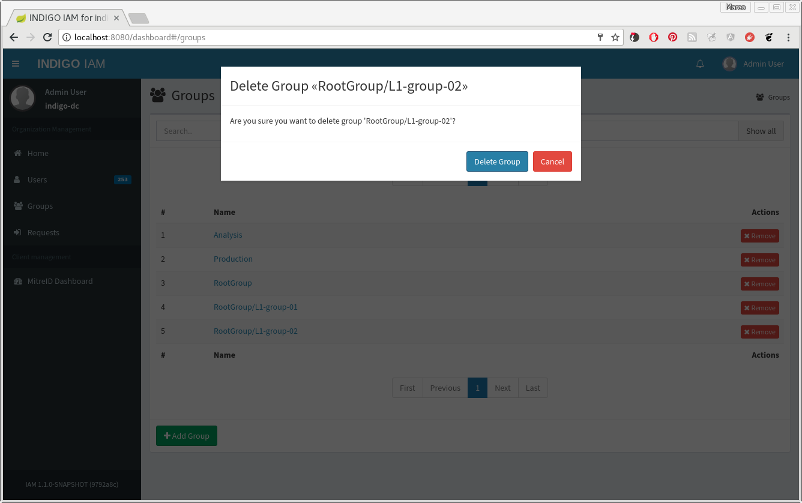
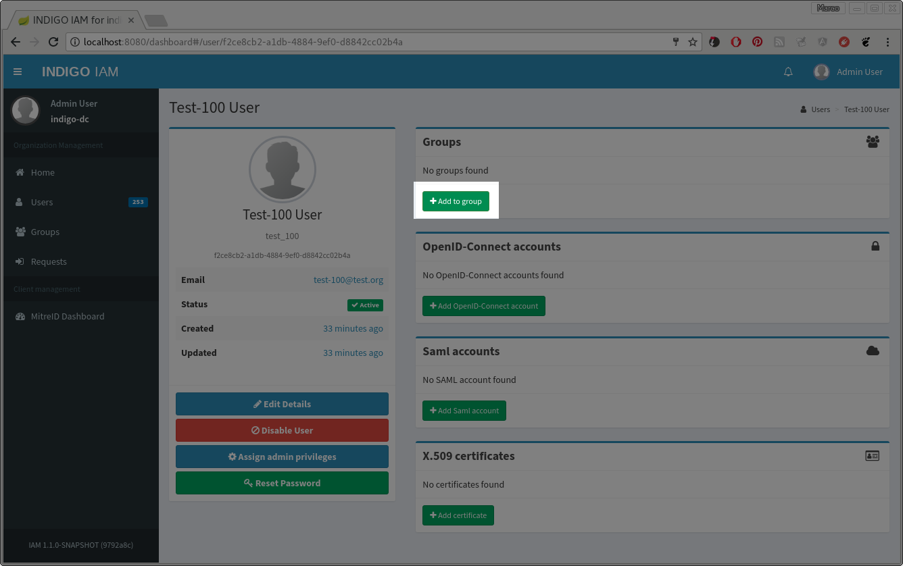
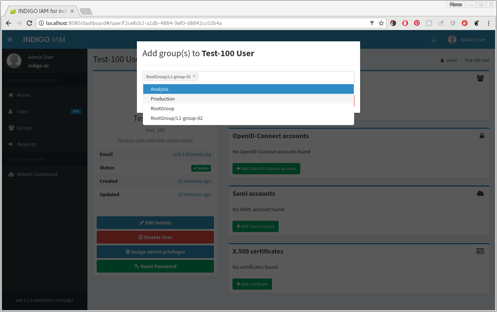
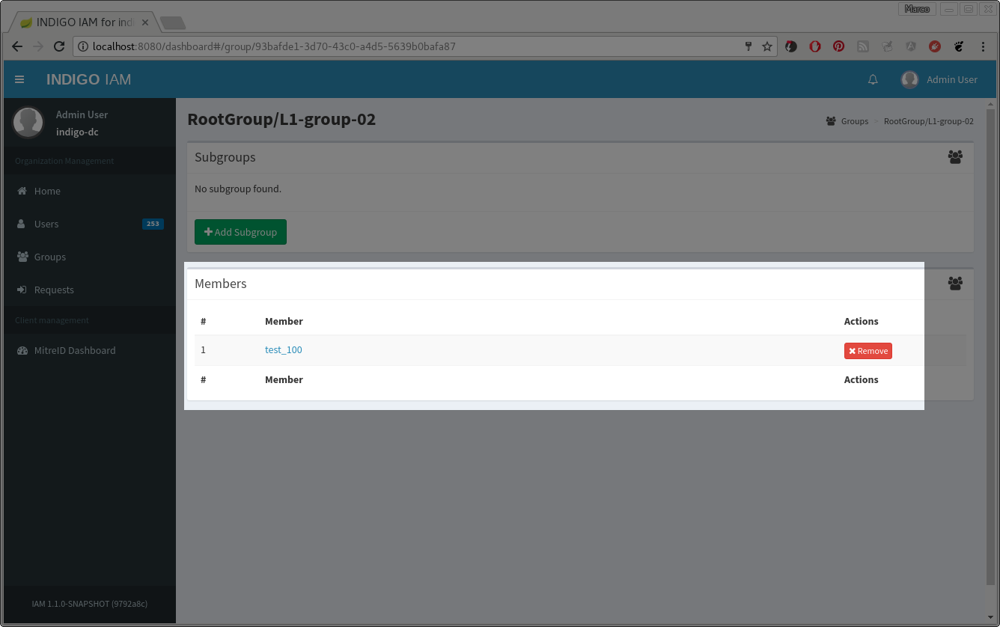

## Groups Management

IAM provides a group management system.
Only users with ``ROLE_ADMIN`` authority can create new groups, remove existing groups
and change the user membership.
Groups can be organized in a hierarchical structure, with the following constraints:
 - a group can have only a parent group;
 - a group can have many childrens.
Groups that are part of a hierarchy, have as displayed name the path from the root group up
to the group itself, similar to the visualization on files in a file system tree.

### Manage groups using the web interface

The simplest way to manage groups is using the web interface dashboard.

#### Creation

From the home page, open the _Groups_ section and click the _Add group_ button:

To create the new group, specify a mandatory group name, of at most 50 characters;
optionally, an existing group can be selected as parent group.
Then confirm the creation.

A new child group can be created also from the parent group details page.
Clicking on the group name, open the details page.
Then, click the _Add Subgroup_ button, specify the name of the new child
group and confirm the creation.

#### Removal

From the groups list page, click on the corresponding _Remove_ button.
A confirmation window will be opened, so you can confirm or abort the
the delete operation.

**WARNING:
Only empty groups can be removed. If you try to remove a group
with a child group or with user members, the operation fails with an error.**

#### User membership

**WARNING:
When a user is added as member of a group, it doesn't inherit the membership
within the parent group. So, you must  explicitly associate the user with all
the groups that it needs to be a member.**

To add a user to a group member, open the user details page.
In the _Groups_ section, click on _Add to group_:

Choose one or more groups and confirm the operation:

To remove the membership, click the _Remove_ button.
The membership can also be managed from the group details page, from the _Members_
section:

