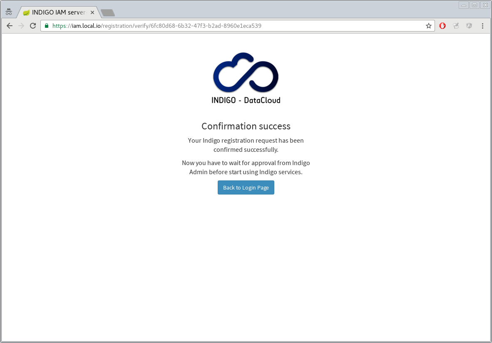
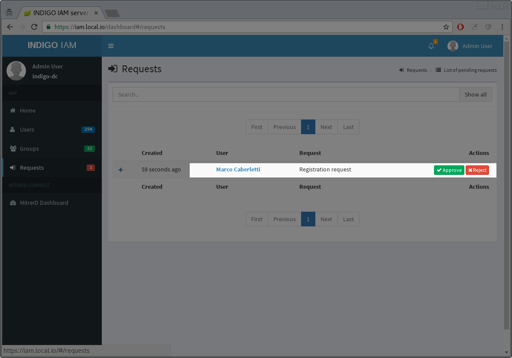
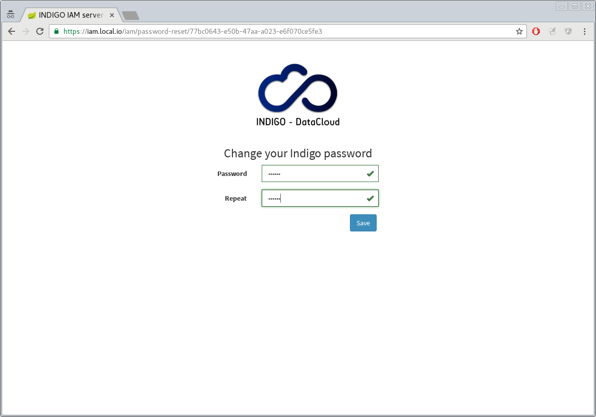
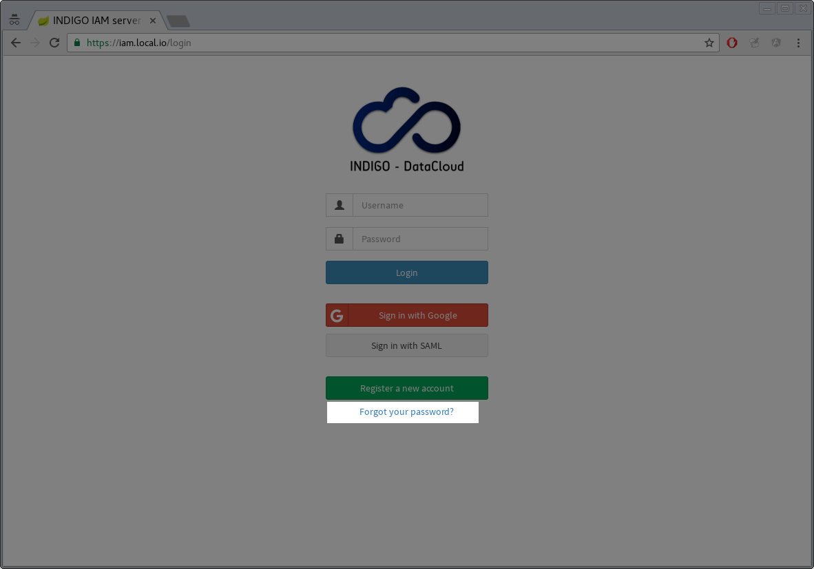

## Registration service

IAM provides a registration service that allows users to submit a memberhip
request. Such request is then approved or rejected by the IAM administrators.

#### New registration

To submit a new registration request, users can go to IAM login page and click
the _Register a new account_ button.

The name, surname, email and username fields are mandatory.
The _notes_ field can used to include extra information targeted at IAM
administrators.

#### Confirm registration request

If the submission ends successfully, an email verification link is sent to the
user email address with a request to confirm his registration request.

Once the request is confirmed, IAM administrators are notified with an email.

#### Requests management

Only IAM users with administrative privileges have the rights to approve or
reject a registration request. 

To performe this operation, log into IAM as administrator and open the new
dashboard by clicking the _New Admin Dashboard_ button in the left-side menu.

On the left, the link _Request_ opens the requests management page.

From this page, an administrator can approve or reject membership requests.

#### Password setup 

Once a request is approved, an email is sent to the user with a reset password
link. This URL points to page where the user can choose a password for the IAM
account.

Once the password is set, users can login to the IAM using the username chosen
at registration time and the password.

## Reset password

To reset their password, users can go to the IAM  login page and click the link _Forgot your password?_.

Users can then enter their email address, and if the entered email address is
linked to a registered user a reset password link will be sent to such email
address.

