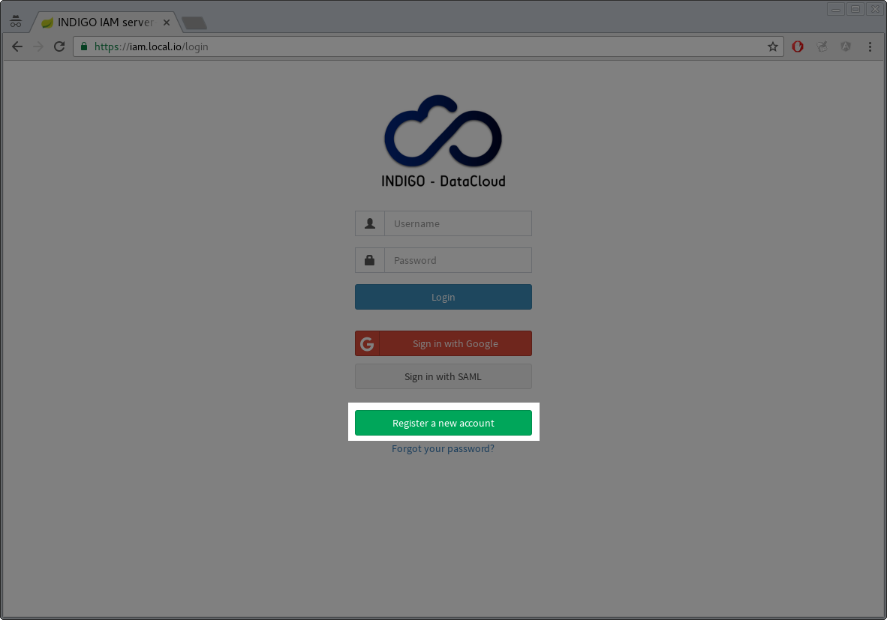
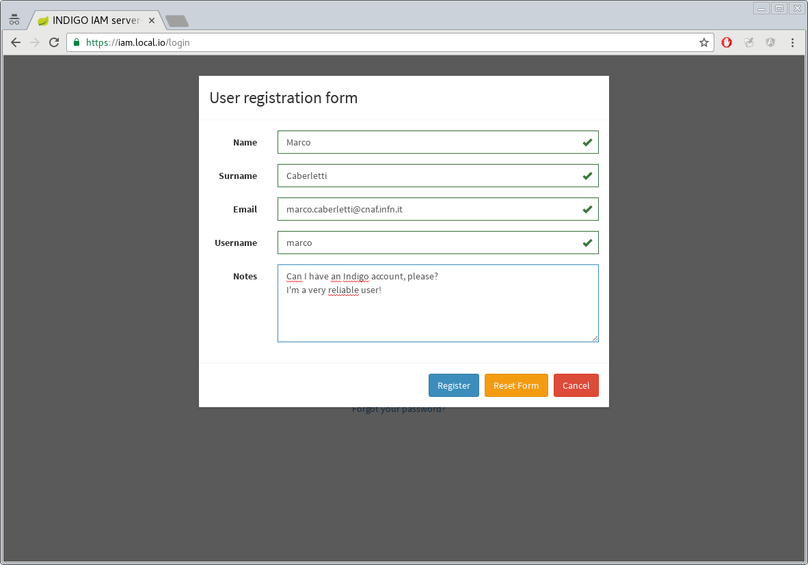
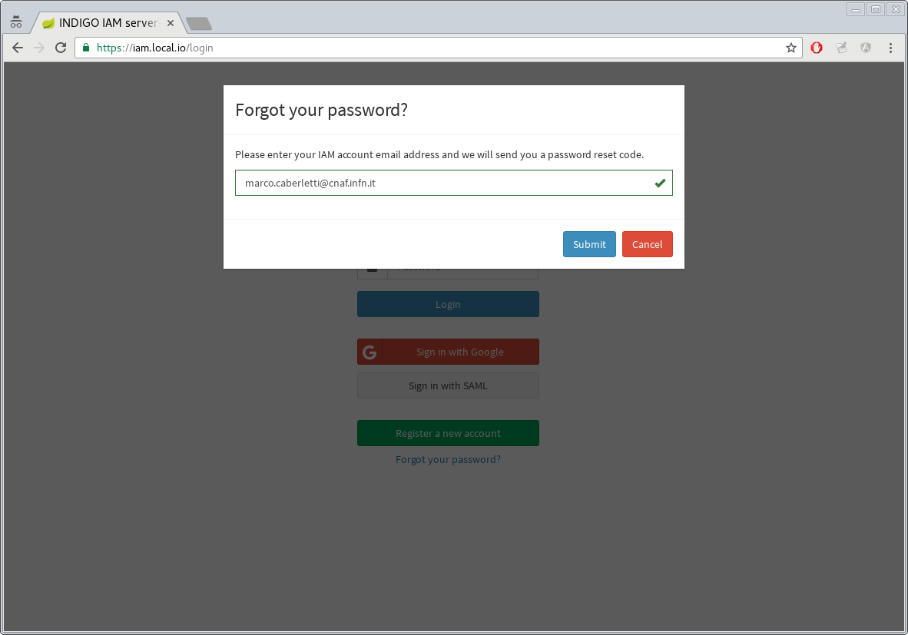

## Registration service

Current release Indigo IAM introduces the functionality that allows users to submit a request of membership
to Indigo.

#### New registration

For insert a new registration request, users can go to IAM login page and click the _Register a new account_ button.

Name, surname, email and username are mandatory fields. With _notes_ field, users can tell to the IAM administrators any extra information about their request of membership.

#### Confirm registration request

If the submission ends successfully, an email with a verification link is sent to the user for 
confirm his registration request and "validate" his email address.

When a new request is confirmed, IAM administrators are notified with an email too.

#### Requests approval or rejection 

Only users with role `ROLE_ADMIN` or `registration:write` scope, can decide to approve or reject a registration request.
To performe this operation, log into IAM as administrator and go to the new dashboard.
On the left, the link "Request" opens the requests management page.
From this page, the administrator can approve or reject the request.

#### Set the new login password

When the IAM administrator approves a registration request, an email is sent to the user with a reset password link.
This URL redirect to an IAM page where users can choose their new password.

If the submission ends successfully, users can login now into Indigo IAM with the new password and the username chosen at the registration time.

## Reset password

#### Change password

For reset their password, users can go to the IAM  login page and click the link _Forgot your password?_.

The new form opened allow to specify the email address to which send the reset password link.  

If the email specified is bounded to a valid Indigo user, that user will receive
an email with a reset password link.

Now, the flow is the same describe above in the last step of the registration process.
